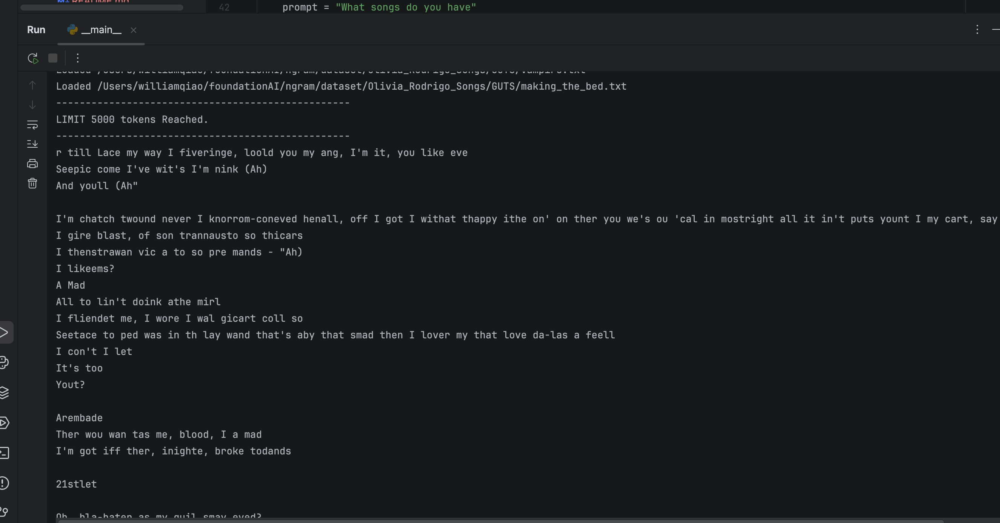
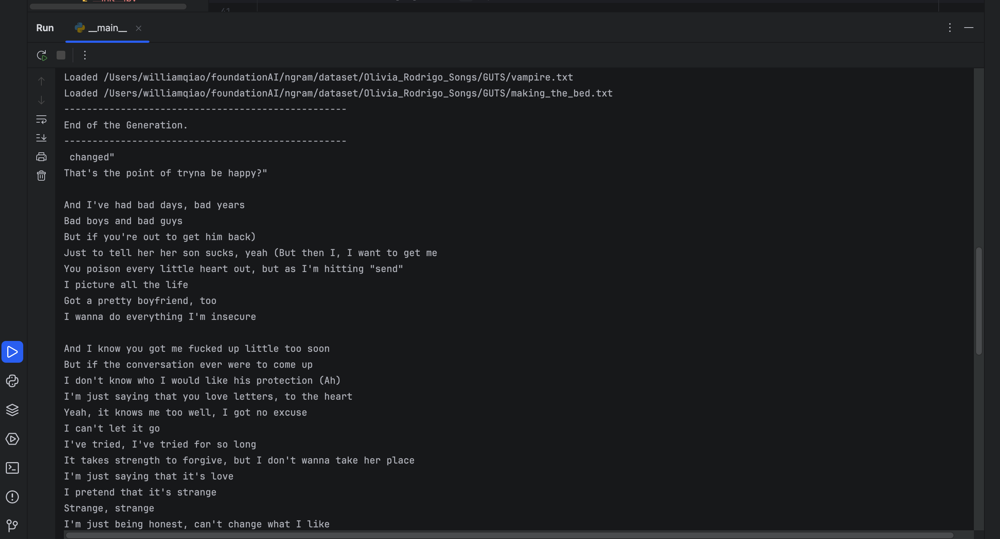

# Character Ngram Language Model

This repository contains the implementation of a Character N-gram Language Model. It allows you to train and evaluate a language model based on character-level n-grams from text data.

## To Begin With
The main function file is located in:
```bash
ngramlm/lm/__main__.py
```
To run the model with the default configuration, execute the following command:

```bash
python -m ngramlm.lm
```

## Dataset Config

The default dataset used for this lm is `Olivia_Rodrigo_Songs`
The training dataset can be replaced in `dataset/`. After replace the files, edit the `defaults.py` in `ngramlm/config/`

### For ngram K = 3


### For ngram K = 10
